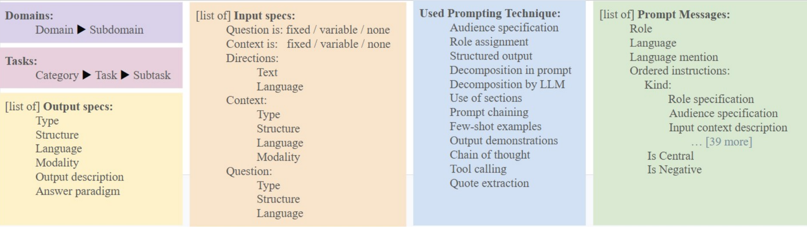

# 📚 Prompts in the Wild: A Large Analyzed Collection of Transactional Prompts in Code

A large-scale collection of real-world transactional prompts extracted from GitHub repositories, accompanied by a comprehensive ontology, rich structural and semantic annotations, and an interactive browser for systematic exploration.

This repository accompanies the paper:

[**Prompts in the Wild: A Large Analyzed Collection of Transactional Prompts in Code**](https://github.com/OnlpLab/transactionalPromptsCollection/blob/main/paper/TransactionalPromptCollection.pdf)

*The 20th Linguistic Annotation Workshop (LAW XX), ACL 2026*

---

## 🔗 Quick Links

📄 **Paper:** [Read the paper](https://github.com/OnlpLab/transactionalPromptsCollection/blob/main/paper/TransactionalPromptCollection.pdf)

🌐 **Interactive Browser:** [Explore the collection](https://onlplab.github.io/transactionalPromptsCollection/app/)

📦 **Dataset:** *(Coming soon)*

---

## Overview

This project presents a large collection of real-world **transactional prompts** extracted from open-source GitHub repositories together with a rich ontology describing both their semantic properties (such as task, domain, prompting techniques, languages) and their structural components (e.g., instruction blocks, input context and question, output specifications).

The repository also includes an interactive user interface that allows researchers to browse, search, filter and inspect prompts using the proposed ontology.

---

## Main Features

- **57,000+ transactional prompts** extracted from real GitHub repositories
- Prompt-level metadata including repository information and timestamps
- Rich semantic annotations including:
  - task
  - domain
  - language
  - modality
  - prompting techniques
  - instruction blocks
  - and more
- Search and filtering over the prompt collection
- Downloadable filtered prompt subsets

---

## Interactive Browser

Explore the collection directly in your browser:

## 👉 **[Launch the Interactive Browser](https://onlplab.github.io/transactionalPromptsCollection/app/)**

The browser allows users to:

- search and filter prompts using ontology attributes
- inspect prompt structure
- highlight structural spans
- download filtered subsets

## Basic Dataset Statistics

| Statistic | Value |
|------------|------:|
| Prompts | **57,640** |
| GitHub repositories | **34,249** |
| GitHub files processed | **53,630** |

For a complete analysis, see the accompanying paper.

## Annotation Ontology

The ontology captures multiple properties and components of transactional prompts, including:

- Task
- Domain
- Modality
- Languages
- Input and output specifications
- Prompting techniques
- Instruction blocks

A complete description of the ontology is available in the paper.

<!-- Optional ontology figure -->

## Acknowledgments

Work on this project was supported by a VATAT grant from the Planning and Budgeting Committee of the Council for Higher Education in Israel, Kamin grant by the Israel Innovation Authority (IIA) and ISF grant number 670/23.